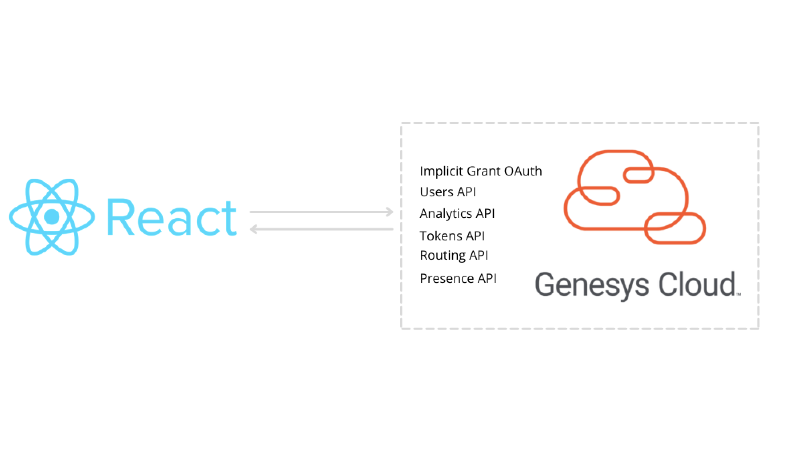
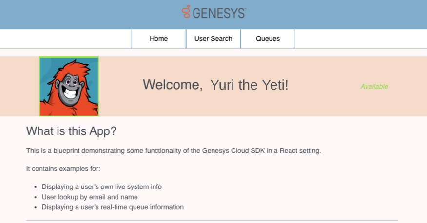

This Genesys Cloud Developer Blueprint demonstrates how to include the Genesys Cloud Javascript Platform SDK in a React app. This solution uses Typescript, although the implementation will be similar if you're using plain JavaScript. This solution includes a sample React app that explores use cases such as creating a profile page for a user and completing admin operations such as signing all the users out of a queue.

:::primary
 **Note**: This blueprint uses React v16. Higher versions will require additional webpack configuration. :::



## Contents

* [Solution components](#solution-components "Goes to the Solutions components section")
* [Prerequisites](#prerequisites "Goes to the Prerequisites section")
* [Sample React app](#sample-react-app "Goes to the Sample React app section")
* [Run the sample React app locally](#run-the-sample-react-app-locally "Goes to the Run the sample React app locally section")
* [Implementation steps](#implementation-steps "Goes to the Implementation steps section")
* [Additional resources](#additional-resources "Goes to the Additional resources section")

## Solution components

* **Genesys Cloud** - A suite of Genesys cloud services for enterprise-grade communications, collaboration, and contact center management. In this solution, a Genesys Cloud user account is required in order for the React app to be authorized to integrate with Genesys Cloud.
* **React** - A JavaScript library for efficiently building interactive user interfaces.  
* **TypeScript** - An object-oriented programming language that facilitates the development of JavaScript applications by supporting static typing.  

### Software development kits

* **Platform API Client SDK - Javascript** - Client libraries used to simplify application integration with Genesys Cloud by handling low-level HTTP requests. In this solution, the SDK authorizes the user and performs the API calls required to execute the administrator features.

## Prerequisites

### Specialized knowledge

* Experience using the Genesys Cloud Platform API
* Experience with React
* Experience with Typescript or JavaScript  

### Genesys Cloud account requirements

This solution requires a Genesys Cloud license. For more information on licensing, see [Genesys Cloud Pricing](https://www.genesys.com/pricing "Opens the pricing article").

A recommended Genesys Cloud role for the solutions engineer is Master Admin. For more information on Genesys Cloud roles and permissions, see the [Roles and permissions overview](https://help.mypurecloud.com/?p=24360 "Opens the Roles and permissions overview article").

## Sample React app

This solution includes a sample React app that uses the Genesys Cloud Javascript Platform SDK to display and update data for Genesys Cloud users.



From the sample React app, you can update some user data, and that updated data is returned to Genesys Cloud in real-time. Specifically:

* The **Home** page displays data from your Genesys Cloud user account, including your profile image and user presence.
* The **User Search** page allows you to search for other users in your Genesys Cloud org by name or email. The results appear as cards that act as miniature profile pages for the found users.
* The **Queues List** page allows you to see Observation Query details for each queue. Within the React app, you can log out all of the agents on a particular queue, which is helpful if those agents cannot log out of their stations after their shift is over.

The sample React app includes the `genesysCloudUtils` file, which contains the intermediate functions that in turn call Genesys Cloud SDK methods. These functions return promises that are handled upon resolution in the file and in the invoking components themselves.

## Run the sample React app locally

### Download the repository that contains the project files
1. Clone the [blueprint repo](https://github.com/GenesysCloudBlueprints/react-app-with-genesys-cloud-sdk) to your local machine.

  ```bash
  git clone https://github.com/GenesysCloudBlueprints/react-app-with-genesys-cloud-sdk.git
  ```
### Create an Implicit Grant OAuth client in Genesys Cloud

1. Create an OAuth client with the following settings:
  * **Grant type**: Implicit Grant (Browser)
  * **Authorized redirect URIs**:`http://localhost:3000`. If you've changed the **redirectUri** value in the src > clientConfig.js file, then use your new URI.
  * **Scopes**
    * analytics
    * authorization
    * presence
    * routing
    * users
2. Note the client ID. You will use this later to configure your project.  

For more information, see [Create an OAuth client](https://help.mypurecloud.com/?p=188023 "Goes to the Create an OAuth client article") in the Genesys Cloud Resource Center.

### Update the configuration file

Modify the values in the clientConfig.js file before running the app. Use the values from your [OAuth client](#create-an-implicit-grant-oauth-client-in-genesys-cloud "Goes to the Create an Implicit Grant OAuth client in Genesys Cloud section"):

```javascript
export const clientConfig = {
  GENESYS_CLOUD_CLIENT_ID: '<YOUR CLIENT ID HERE>',
  REDIRECT_URI: '<YOUR PRODUCTION URI HERE>',
};
```

### Run the app

Open a terminal window and set the working directory to the root directory of the project. Then run the following:

```bash
npm install
npm run start
```
## Implementation steps

To integrate the Genesys Cloud SDK into your own React app, complete the following steps.

### Create a React project

If you are creating a new app from scratch, run the following commands in a terminal in the directory of your choice:

```bash
npm install -g npx
npx create-react-app name-of-your-app --template typescript
```

If you're configuring an existing React app, we recommend that you use version 16.0 or later, since the sample app uses React hooks, which were introduced in React version 16.0.
See the tsconfig.json file in the root directory of this project for a TypeScript configuration example.

### Install NPM packages

Install the Genesys Cloud platform client:

```bash
npm install purecloud-platform-client-v2
```

### Import the Genesys Cloud Platform API Client SDK - JavaScript to your project

Use the following to import the Genesys Cloud Platform API Client SDK - JavaScript:

```javascript
const platformClient = require('purecloud-platform-client-v2/dist/node/purecloud-platform-client-v2.js');
  ```
You can now use the various API tools that are contained in the platformClient object:

```javascript
const platformClient = require('purecloud-platform-client-v2/dist/node/purecloud-platform-client-v2.js');
const searchApi = new platformClient.SearchApi();
const usersApi = new platformClient.UsersApi();
const analyticsApi = new platformClient.AnalyticsApi();
const tokensApi = new platformClient.TokensApi();
const routingApi = new platformClient.RoutingApi();
const presenceApi = new platformClient.PresenceApi();
```

## Additional resources

* [Genesys Cloud Platform SDK - Javascript](/api/rest/client-libraries/javascript/ "Goes to the Platform API Client SDK - JavaScript page") in the Genesys Cloud Developer Center
* [Create a New React App](https://reactjs.org/docs/create-a-new-react-app.html "Goes to the Create a New React App page") in the React documentation
* [react-app-with-genesys-cloud-sdk repository](https://github.com/GenesysCloudBlueprints/react-app-with-genesys-cloud-sdk) in Github
